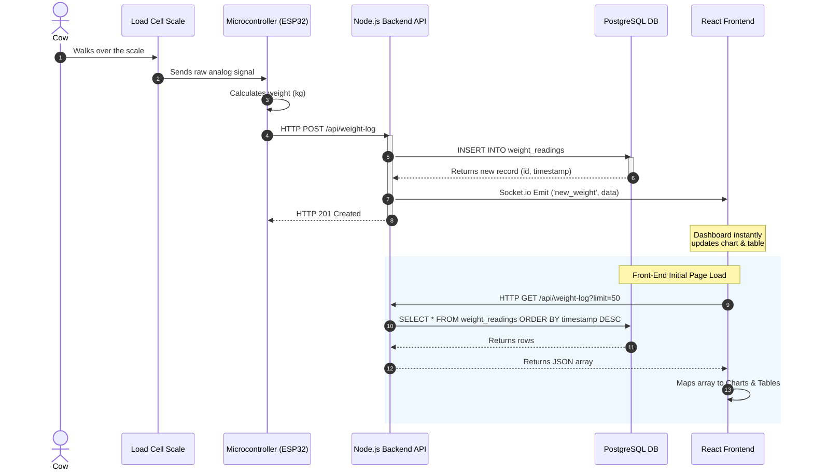

# System Architecture & Flowchart

This document details the end-to-end data flow and API integrations for the **WalkScale Cow Dashboard**.

## 🔌 API Endpoints & Events

### 1. HTTP REST API
The Node.js/Express backend provides the following RESTful endpoints:

#### **Ingest New Reading**
Used by the IoT hardware (ESP32/LoRa receiver) to send data when a cow walks over the scale.

*   **Endpoint**: `POST /api/weight-log`
*   **Content-Type**: `application/json`
*   **Payload**:
    ```json
    {
      "device_id": "NODE-01",
      "weight_kg": 542.5,
      "timestamp": "2026-05-08T12:00:00.000Z" // Optional: Backend will generate if omitted
    }
    ```
*   **Response (201 Created)**:
    ```json
    {
      "message": "Data logged successfully",
      "data": {
        "id": 12,
        "device_id": "NODE-01",
        "weight_kg": 542.5,
        "timestamp": "2026-05-08T12:00:00.000Z"
      }
    }
    ```

#### **Fetch Historical Data**
Used by the React frontend on initial load to populate the dashboard charts and tables.

*   **Endpoint**: `GET /api/weight-log?limit=50`
*   **Response (200 OK)**:
    ```json
    [
      {
        "id": 12,
        "device_id": "NODE-01",
        "weight_kg": 542.5,
        "timestamp": "2026-05-08T12:00:00.000Z"
      },
      ...
    ]
    ```

### 2. WebSocket Events (Socket.io)
Real-time communication between the backend and browser clients.

*   **Connection**: Clients connect via `ws://<BACKEND_URL>` (Port 3001).
*   **Event**: `new_weight`
    *   **Direction**: Server ➔ Client (Broadcast)
    *   **Trigger**: Emitted instantly after a successful `POST /api/weight-log` database insertion.
    *   **Payload structure**: Matches the individual reading JSON object.

---

## 📊 Process Flowchart

Here is the operational sequence from the moment a cow steps on the scale to when the farmer sees it on the screen:



## 🧩 Internal System Mechanics

1. **Hardware Capture**:
   - The cow steps onto the walk-over scale. Load cells generate an analog electrical signal.
   - An ADC (like HX711) converts this to digital data.
   - The Microcontroller algorithms apply calibration factors to determine the weight in `kg`.
2. **Data Transmission**:
   - The MCU formats the data into a JSON payload and performs an HTTP POST request over Wi-Fi or Cellular/LoRa (via a gateway) to the Node.js API server container.
3. **Storage & Broadcast**:
   - The Express route receives the JSON, validates it, and writes it directly to the Docker-managed PostgreSQL database.
   - Upon successful database commit, the `RETURNING` SQL clause hands the final record back to Node.js.
   - Node.js immediately pushes this record to the global Socket.io instance.
4. **Client Visualization**:
   - Any currently open React Dashboard instances pick up the `new_weight` Socket event.
   - React state hooks safely prepend the new object to the tables and push the data point onto the Recharts timeline, ensuring a fluid real-time experience without page reloads.
